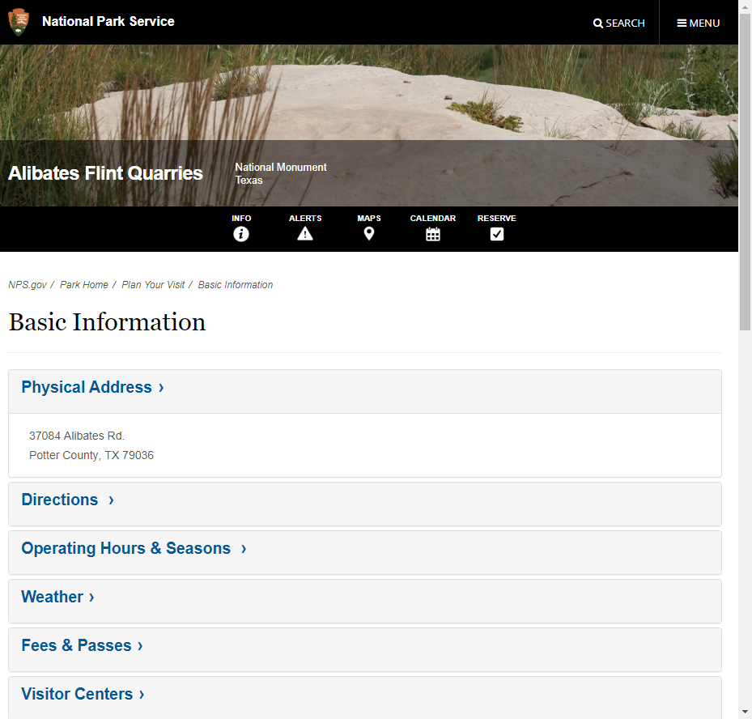

# NPS Website Scrape
 
All code can be found under the jupyter notebook file. Websites are based on a 4-letter alpha for each of the 394 National Park units, found in the csv file. This program uses chromedriver and is set to only run for the first 50 parks as is. It will calculate 10 transportation-related fields for each national park in the U.S. These calculations use basic natural language processing where key words or phrases are aggregated on all pages for each website, and cutoffs are used based on total number of web pages per park where key word/phrases are used. 

# Example Site:
An example of the Yosemite site [here](https://www.nps.gov/yose/index.htm). The program iterates to look for all urls on the site then move to those sites and acquire all urls on those pages. Once there are no new urls for the trip planning then the program will begin looking for key words and phrases. 

# Site Picture:

